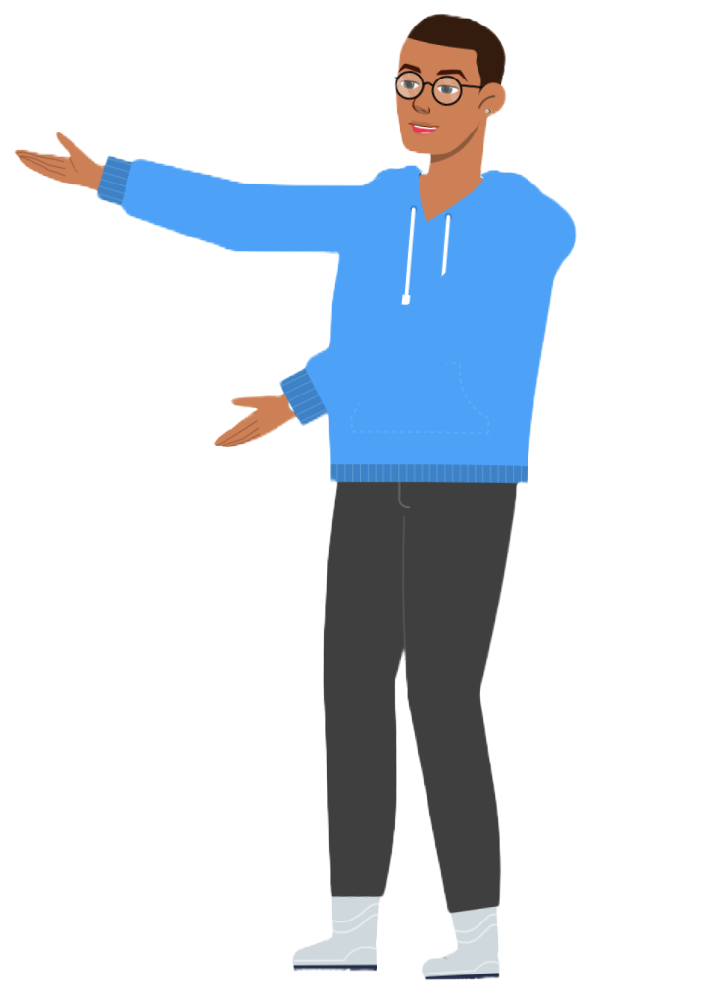

<h1 align="center">Hi 👋, I'm Michias</h1>

I'm a fourth year software engineering student.

 

Want to know more about me? [Check out my portfolio.](https://michias.vercel.app/)

<h3 align="left">Connect with me:</h3>

 

## &#x1f4c8; GitHub Stats

 

## 💼 Skills

 

## 💾 Databases

 

 

More Skills

 

 

 

 

### 📺 Latest YouTube Videos
<!-- BEGIN YOUTUBE-CARDS -->
[")](https://www.youtube.com/watch?v=-88EtV-uv_s#gh-dark-mode-only)[")](https://www.youtube.com/watch?v=-88EtV-uv_s#gh-light-mode-only)

[")](https://www.youtube.com/watch?v=AcmCtrb1mV8#gh-dark-mode-only)[")](https://www.youtube.com/watch?v=AcmCtrb1mV8#gh-light-mode-only)
<!-- END YOUTUBE-CARDS -->

